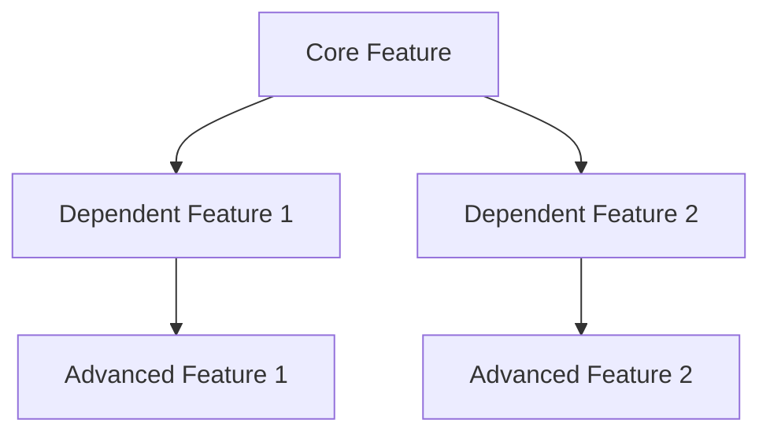

# [PROJECT_NAME] Feature Status Overview

**Last Updated:** [Date]  
**Current Focus:** [Current development focus]  
**Active Features:** [List active features]

## Overall Progress

| Feature | Foundation | Enhancement | Optimization | Overall | Branch | Status |
|---------|------------|-------------|--------------|---------|--------|---------|
| [Feature 1] | 🔄 In Progress | 📋 Planned | 📋 Planned | 25% | `feature/[feature-1]` | Active |
| [Feature 2] | 📋 Planned | 📋 Planned | 📋 Planned | 0% | `feature/[feature-2]` | Planned |
| [Feature 3] | ➖ N/A | 📋 Planned | 📋 Planned | 0% | `feature/[feature-3]` | Planned |

**Legend:**
- ✅ Complete
- 🔄 In Progress  
- 📋 Planned
- ➖ Not Applicable

## Current Focus

### 🎯 Active Features

#### [Feature Name]
- **Goal:** [Brief description of feature goal]
- **Progress:** [X]% complete
- **Current Task:** [What's currently being worked on]
- **Blockers:** [Any current blockers or "None"]
- **Next:** [Next steps or milestones]

#### [Another Feature Name]
- **Goal:** [Brief description of feature goal]
- **Progress:** [X]% complete
- **Current Task:** [What's currently being worked on]
- **Blockers:** [Any current blockers or "None"]
- **Next:** [Next steps or milestones]

## Feature Dependencies

### Dependency Notes
- **[Feature A]** must be completed before **[Feature B]** can begin
- **[Feature C]** requires **[Feature A]** API endpoints
- **[Feature D]** builds upon **[Feature B]** foundation

## Development Priorities

### High Priority (Current Sprint)
1. **[Feature Name]** - [Brief reason for priority]
2. **[Feature Name]** - [Brief reason for priority]

### Medium Priority (Next Sprint)
1. **[Feature Name]** - [Brief reason for priority]
2. **[Feature Name]** - [Brief reason for priority]

### Low Priority (Future)
1. **[Feature Name]** - [Brief reason for priority]
2. **[Feature Name]** - [Brief reason for priority]

## Recent Completions

### ✅ Completed This Week
- **[Feature/Task]** - [Brief description]
- **[Feature/Task]** - [Brief description]

### ✅ Completed Last Week
- **[Feature/Task]** - [Brief description]
- **[Feature/Task]** - [Brief description]

## Upcoming Milestones

| Milestone | Target Date | Features Included | Status |
|-----------|-------------|-------------------|--------|
| [Milestone 1] | [Date] | [Feature list] | 🔄 In Progress |
| [Milestone 2] | [Date] | [Feature list] | 📋 Planned |
| [Milestone 3] | [Date] | [Feature list] | 📋 Planned |

## Blockers and Issues

### 🚫 Current Blockers
- **[Feature Name]:** [Description of blocker and potential resolution]
- **[Feature Name]:** [Description of blocker and potential resolution]

### ⚠️ Risks and Concerns
- **[Risk Description]:** [Impact and mitigation strategy]
- **[Risk Description]:** [Impact and mitigation strategy]

## Team Assignments

| Team Member | Primary Feature | Secondary Feature | Status |
|-------------|-----------------|-------------------|--------|
| [Name] | [Feature] | [Feature] | Active |
| [Name] | [Feature] | [Feature] | Active |

## Feature Details

### [Feature Name 1]
- **PRD Reference:** [Section numbers]
- **Specifications:** `.trae/features/[feature-name]/specs/`
- **Documentation:** `.trae/features/[feature-name]/docs/`
- **Branch:** `feature/[feature-name]`
- **Dependencies:** [List dependencies]
- **Estimated Completion:** [Date or timeframe]

### [Feature Name 2]
- **PRD Reference:** [Section numbers]
- **Specifications:** `.trae/features/[feature-name]/specs/`
- **Documentation:** `.trae/features/[feature-name]/docs/`
- **Branch:** `feature/[feature-name]`
- **Dependencies:** [List dependencies]
- **Estimated Completion:** [Date or timeframe]

## Notes and Updates

### [Date] - [Update Title]
- [Description of update or change]
- [Impact on timeline or features]

### [Date] - [Update Title]
- [Description of update or change]
- [Impact on timeline or features]

---

**Instructions for Updating:**
1. Update progress percentages weekly
2. Move completed features to "Recent Completions"
3. Add new blockers or risks as they arise
4. Update team assignments when roles change
5. Keep milestone dates realistic and current